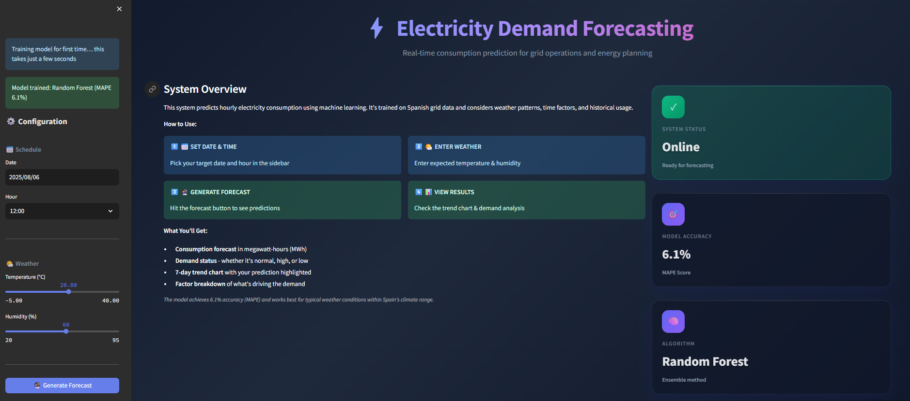

# Electricity Consumption Forecasting

A machine learning pipeline to predict hourly electricity consumption using historical data and weather features.

## Dataset Details

I used two CSV files provided:

1. **Energy Data** (`energy_dataset.csv`)
   - 35,064 hourly records of Spanish electricity consumption (2015-2018)
   - Key field: `total_load_actual` (converted MW to MWh)

2. **Weather Data** (`weather_features.csv`) 
   - Weather data from 5 Spanish cities
   - Temperature, humidity, pressure, wind speed

source: `https://www.kaggle.com/datasets/nicholasjhana/energy-consumption-generation-prices-and-weather/data`

**Data Preparation:**
- Cleaned timestamps and merged energy + weather data by hour
- Averaged weather across all cities for each hour
- Final dataset: ~34,000 complete records

## Modeling Approach

### Features Created
- **Time features:** hour of day, day of week, month
- **Flags:** weekends, holidays, business hours, peak hours  
- **Weather:** temperature (Celsius), humidity, high temp flag
- **Lag features:** consumption 24h ago, 168h ago (same hour yesterday/last week)

### Models Tested
1. **Linear Regression** - Simple baseline
2. **Random Forest** - Selected as best model
3. **Persistence Model** - Baseline (use yesterday's value)

### Results
- **Best Model:** Random Forest Regressor
- **MAPE:** 6.13% (good accuracy for electricity forecasting)
- **R² Score:** 0.7001
- **Training:** Chronological split (60% train, 20% validation, 20% test)

I chose Random Forest because it had the lowest error rate and trains quickly.

## Setup and Usage

### Requirements
```
pandas
numpy  
scikit-learn
streamlit
joblib
holidays
plotly
```

### Installation
```bash
# Clone or download the project
git clone https://github.com/syafiq5675/electricity-forecast.git
cd electricity-forecast

# Create virtual environment
python -m venv mlenv
# Activate it
# Windows: mlenv\Scripts\activate
# Mac/Linux: source mlenv/bin/activate

# Install dependencies
pip install -r requirements.txt
```

### Running the Code

streamlit run src/deploy.py
```


* **First Launch**: Auto‑trains features & model and saves to `models/`.
* **Subsequent**: Loads pre‑trained model instantly.
* Open in browser: `http://localhost:8501`

### **Manual Pipeline (Optional)**

If you prefer step‑by‑step:

```bash
# 1. Feature engineering
default: python src/features.py
# 2. Model training
default: python src/model.py
# 3. Launch app
streamlit run src/deploy.py
```

## Web Interface

Jump straight into forecasting with these simple steps:

1. **Pick Your Moment**  
   Choose any date and hour to see the prediction.

2. **Set the Weather**  
   Slide the temperature and humidity controls to your scenario.

3. **Click “Forecast”**  
   Get instant results in MWh with one button.

4. **Check the Trend**  
   View an interactive 7-day chart of past use and future forecasts.




## Files Structure
```
├── src/
│   ├── features.py      # Feature engineering  
│   ├── model.py         # Model training
│   └── deploy.py        # Streamlit web app
├── datasets/            # Raw and processed data
├── models/              # Trained model files
└── requirements.txt     # Dependencies
```